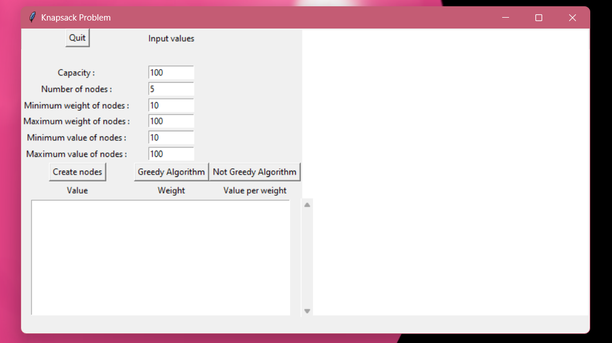
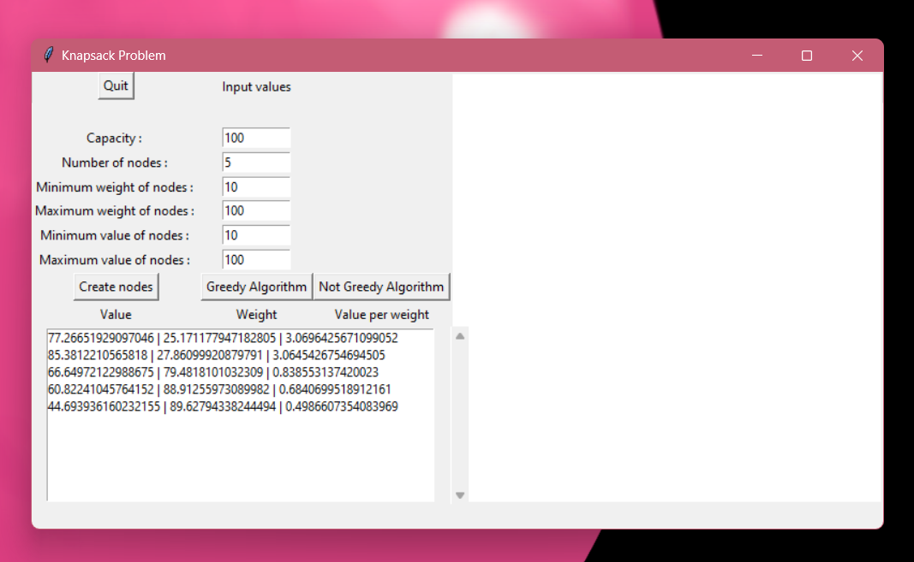
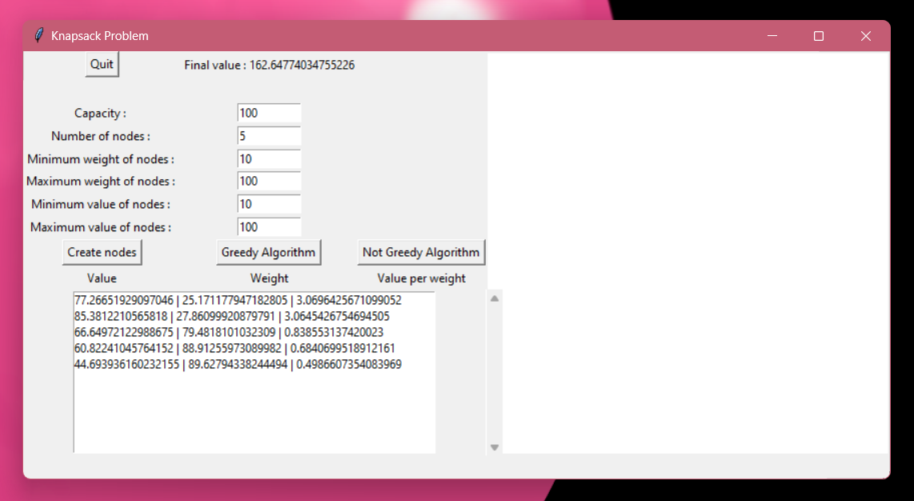
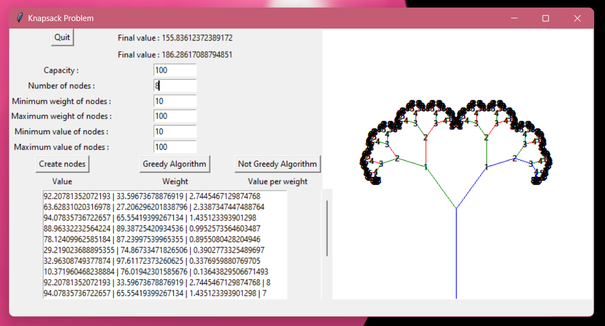

# knapsack_problem
Made in 2018 (school project) using Python and Tkinter (Python binding to the Tk GUI toolkit).
Showcases 2 algorithms (greedy and recursive) solving the knapsack problem (Problem in combinatorial optimization).

Poor performance for recursion using more than nine nodes.
Ugly interface.

## Window on launch

## Generating Nodes

## Greedy algorithm output

## Recursive algorithm output and graph displayed
